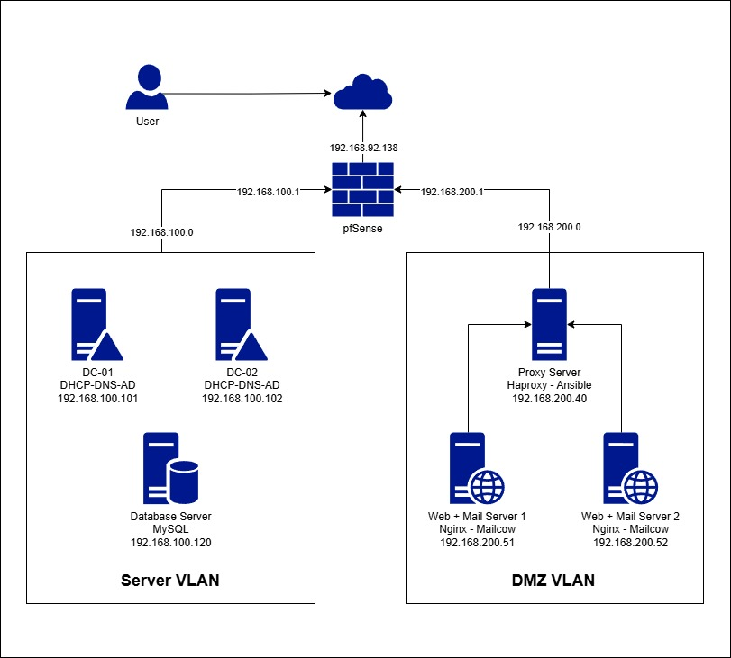

# Bài tập lớn

## Mô Hình Bài Lab



| VM | Chức năng | IP | mac-address |
| --- | --- | --- | --- |
| pfSense | Route + Firewall<br>Server VLAN<br>DMZ VLAN | 192.168.92.138<br>192.168.100.1<br>192.168.200.1 | 00:0C:29:E6:4F:00<br>00:0C:29:E6:4F:0A<br>00:0C:29:E6:4F:14 |
| HAProxy | Proxy server + Ansible | 192.168.200.40 | 00:50:56:20:76:7E |
| Mail-01 | Nginx 1 + Mailcow 1 | 192.168.200.51 | 00:50:56:26:55:74 |
| Mail-02 | Nginx 2 + Mailcow 2 | 192.168.200.52 | 00:50:56:2E:D3:69 |
| DC-01 | DHCP - DNS - AD 1 | 192.168.100.101 | 00:0C:29:2A:A2:0D |
| DC-02 | DHCP - DNS - AD 2 | 192.168.100.102 | 00:0C:29:34:3E:0C |
| Database Server | MySQL | 192.168.100.120 | 00:50:56:32:26:40 |

## Phần 1: PFSENSE

### Bước 1.1: Thêm card mạng thứ 3 cho pfsense để chia VLAN

| Card mạng | IP | Nhiệm vụ |
| --- | --- | --- |
| VMnet8 : Nat | 192.168.92.138 | ra internet |
| VMnet1 : Host-Only | 192.168.100.1 | Server VLAN |
| VMnet2 : Host-Only | 192.168.200.1 | DMZ VLAN |

Thêm 1 card sử dụng VMnet2 có IP : 192.168.200.1 để dùng cho DMZ zone

### Bước 1.2: Khai **báo cổng (Assign Interfaces)**

Khi màn hình console của pfSense hiển thị lại menu chính từ `0` đến `16`, thực hiện:

1. Gõ **`1`** và ấn **Enter** để chọn mục `Assign Interfaces`.
2. Hệ thống hỏi: **`Should VLANs be set up first? [y|n]`** → Gõ **`n`** (No) rồi ấn **Enter**.
3. Hệ thống yêu cầu gán cổng WAN: Nhìn danh sách bên trên, nếu WAN đang là `em0`, bạn gõ **`em0`** rồi ấn **Enter** (hoặc cứ ấn Enter để giữ nguyên mặc định).
4. Hệ thống yêu cầu gán cổng LAN : Gõ **`em1`** rồi ấn **Enter**.
5. Hệ thống hiển thị: **`Optional 1 interface name (or nothing if finished):`** → Đây chính là lúc gán card thứ 3. Gõ **`em2`** rồi ấn **Enter**.
6. Hệ thống hỏi tiếp Optional 2, ấn **Enter** để bỏ qua.
7. Hệ thống hỏi: **`Do you want to proceed? [y|n]`** → Gõ **`y`** rồi ấn **Enter** để lưu lại cấu hình phân chia card.

### **Bước** 1.**3: Đặt IP tĩnh `192.168.200.1` cho cổng mới**

Tại menu chính của pfSense:

1. Gõ **`2`** và ấn **Enter** để chọn mục `Set Interface IP address`.
2. Hệ thống hiển thị danh sách các cổng hiện có kèm số thứ tự (Ví dụ: 1: WAN, 2: LAN, 3: OPT1). Gõ số ứng với cổng **`OPT1`** (**`3`**) rồi ấn **Enter**.
3. Hệ thống hỏi: **`Configure IPv4 address via DHCP? [y|n]`** → Gõ **`n`** rồi ấn **Enter**.
4. Hệ thống yêu cầu nhập IP: Gõ **`192.168.200.1`** rồi ấn **Enter**.
5. Hệ thống yêu cầu chọn Subnet mask (bằng số): Gõ **`24`** (tương đương với `255.255.255.0`) rồi ấn **Enter**.
6. Hệ thống hỏi về IPv4 Upstream Gateway: Nhấn **Enter** để bỏ qua (vì pfSense chính là Gateway của dải này rồi).
7. Hệ thống hỏi cấu hình IPv6: Gõ **`n`** hoặc ấn **Enter** để bỏ qua.
8. Hệ thống hỏi: **`Do you want to enable the DHCP server on OPT1? [y|n]`** * **Lời khuyên:** Chọn **`n`** (No) vì theo mô hình, các máy chủ DMZ (Proxy, Web, Mail) bắt buộc phải đặt IP tĩnh (Static) trong hệ điều hành của chúng để đảm bảo tính cố định, không cần cấp DHCP tự động.
9. Hệ thống hỏi: **`Do you want to revert to HTTP as the webConfigurator protocol? [y|n]`** → Gõ **`n`** rồi ấn **Enter**.

### Bước 1.4: Tạo một Rule Firewall cơ bản để dải DMZ có mạng

1. Vào mục **Firewall** > **Rules** > chọn tab **DMZ**.
2. Ấn nút **Add** (mũi tên hướng lên trên) để tạo Rule mới:
    - **Action:** Pass
    - **Interface:** DMZ
    - **Address Family:** IPv4
    - **Protocol:** Any
    - **Source:** DMZ net
    - **Destination:** Any
3. Ấn **Save** và **Apply Changes**.
    
    .png)
    
    Tạo 3 card mạng trên pfSense
    

### Bước 1.5: Mở Port 8080 trên Firewall PfSense

Vào giao diện Web PfSense → **Firewall** → **Rules** → chọn tab **LAN**:

1. Thêm một luật (**Add**).
2. **Action:** `Pass` (Cho phép).
3. **Interface:** `LAN`.
4. **Protocol:** `TCP`.
5. **Source:** `Any` .
6. **Destination:** Chọn `Address or alias` → Điền IP con Proxy: **`192.168.200.40`**.
7. **Destination Port Range:** Chọn từ `HTTP (80)` đến `HTTP (80)`.
8. Ấn **Save** và **Apply Changes**.

Tạo thêm 1 Rules tương tự cho:

- port: 8080 cho mail.longpd.com
- port: 8484 cho trang stats của Haproxy

## Phần 2: DC-01

### I. Cấu hình DHCP

#### Bước 1.1: Cấu hình Scope DHCP cho vùng DMZ (DC-01)

1. Đăng nhập vào **DC-01**, mở công cụ quản lý **DHCP Manager**.
2. Chuột phải vào mục **IPv4** > Chọn **New Scope...**
3. Đặt tên cho Scope (Ví dụ: `DMZ`).
4. Định nghĩa dải IP cấp phát cho DMZ:
    - **Start IP address:** `192.168.200.20`
    - **End IP address:** `192.168.200.230` (tùy mình quy hoạch).
    - **Exclude IP** : `192.168.200.40` - `192.168.200.59` (setup cho Proxy, Mail, Web Server)
    - **Length:** `24` (Subnet Mask: `255.255.255.0`).
5. Ở mục cấu hình **DHCP Options** (Cực kỳ quan trọng để các máy DMZ đi được Internet và phân giải được tên miền):
    - **003 Router (Default Gateway):** Điền IP cổng DMZ của pfSense: `192.168.200.1`.
    - **006 DNS Servers:** Điền IP của chính con DC-01: `192.168.100.101`.
6. Kích hoạt (Activate) Scope này lên.

<aside>
💡 Tận dụng Scope DHCP 192.168.100.0 từ đầu ngày học làm vùng Server VLAN
</aside>

#### Bước 1.2: Cấu hình DHCP Failover trên DC-01

Cấu hình Failover để nếu DC-01 sập thì DC-02 sẽ lên thay thế cấp phát IP
(Cài đặt tính năng DHCP trên DC-02 trước)

1. Mở **DHCP Manager**.
2. Chuột phải vào Scope mạng (hoặc chuột phải vào mục **IPv4**) > Chọn **Configure Failover**
3. Bấm *Next*, ở ô **Partner Server**, bạn gõ IP của **DC-02** (`192.168.100.102`) để chọn nó làm DC dự phòng.
4. Ở màn hình cấu hình chế độ, bạn có 2 lựa chọn:
    - **Load Balance (Cân bằng tải - Mặc định):** Cả hai máy DC-01 và DC-02 cùng nhau chia sẻ nhiệm vụ cấp IP (Ví dụ: DC-01 cấp 50%, DC-02 cấp 50%). Nếu 1 trong 2 sập, máy còn lại thầu 100%.
    - **Hot Standby (Dự phòng chủ động):** Bình thường DC-01 cấp 100% IP, DC-02 chỉ ngồi chơi giám sát. Khi DC-01 sập, DC-02 lập tức đứng lên thay thế.
5. Nhập mật khẩu dùng chung vào ô **Shared Secret** (Ví dụ: `longpd19`) > Ấn *Next* và *Finish*.

#### Bước 1.3: Bật DHCP Relay trên giao diện Web pfSense

Cấu hình pfSense làm cầu nối đưa gói tin xin IP từ DMZ sang Server VLAN.

1. Đăng nhập vào giao diện WebUI của pfSense (`https://192.168.100.1`).
2. Vào mục **Services** > **DHCP Relay**.
3. Cấu hình tại tab chính:
    - **Enable:** Tích chọn `Enable DHCP relay on interface`.
    - **Downstream Interface:** Nhấn giữ phím `Ctrl` và chọn cả 2 cổng: **LAN** (Server VLAN) và **DMZ**. *(pfSense cần nghe ở DMZ và đẩy sang LAN).*
    - **Append circuit ID...:** Có thể để mặc định.
    - **Upstream server:** Nhập IP của máy cấp DHCP (DC-01): `192.168.100.101`.
    - Click vào nút **`+ Add Upstream Server`** để tạo thêm một dòng trống.
    - Điền thêm IP của **DC-02**: `192.168.100.102`.
4. Ấn **Save**.

<aside>
    
⚠️ **Lưu ý :** Tắt tính năng **DHCP Server** nội bộ của pfSense trên cổng LAN (.100.1), vào mục *Services > DHCP Server > tab LAN >* **Disable** nó đi. pfSense không cho phép bật song song cả DHCP Server và DHCP Relay trên cùng hệ thống và sẽ xung đột DHCP service với DC-01
</aside>

### II. Cấu hình DNS

Luồng hoạt động

```
User gõ demo.lab.local / mail.lab.local
   │
   ├──► DNS trả về IP: 192.168.200.40 (Proxy Server)
   │
   └──► [Gửi request đến Proxy Server (.40)]
               │
               └──► [HAProxy kiểm tra sức khỏe và chia tải bằng Ansible Role]
                           ├──► Chuyển tiếp đến Web 1 (192.168.200.51)
                           └──► Chuyển tiếp đến Web 2 (192.168.200.52)
```

#### Bước 2.1: Tạo Forward Lookup Zone mới

1. Mở **DNS Manager**.
2. Chuột phải vào mục **Forward Lookup Zones** > Chọn **New Zone...**
3. Chọn **Primary Zone** (Tích chọn thêm ô *Store the zone in Active Directory...* để nó tự đồng bộ sang DC02).
4. Đặt **Zone name**: `longpd.com`.
5. Các bước tiếp theo cứ để mặc định và ấn **Finish**.

#### Bước 2.2: Tạo các Record trỏ về Proxy

1. **Bản ghi cho Web:** Chuột phải vào vùng trống > Chọn **New Host (A or AAAA)...**
    - **Name:** `demo`
    - **IP address:** `192.168.200.40` (IP của Proxy Server).
    - Ấn **Add Host**.
2. **Bản ghi cho Mail:** Chuột phải > Chọn **New Host (A or AAAA)...**
    - **Name:** `mail`
    - **IP address:** `192.168.200.40`
    - Ấn **Add Host**.

## Phần 3: ANSIBLE - STRUCTURE

### ANSIBLE STRUCTURE

```
~/ansible-deploy/
├── inventory.ini                <-- File chứa danh sách IP các máy
├── site.yml                     <-- Playbook tổng điều phối các nhóm máy
├── group_vars/                  <-- Thư mục chứa biến theo nhóm máy chủ
│   └── all.yml        
└── roles/
    ├── haproxy/                 <-- ROLE 1: CẤU HÌNH HAPROXY
    │   ├── tasks/
    │   │   └── main.yml         
    │   ├── templates/
    │   │   └── haproxy.cfg.j2
    │   └── handlers/
    │       └── main.yml    
    │
    ├── webserver/               <-- ROLE 2: CẤU HÌNH WEB SERVER (NGINX)
    │   ├── tasks/
    │   │   └── main.yml         
    │   ├── templates/
    │   │   └── index.html.j2    
    │   └── handlers/
    │       └── main.yml 
    │        
    └── mailserver/              <-- ROLE 3: CẤU HÌNH MAIL SERVER (Cài Mailcow Docker)
        └── tasks/
            └── main.yml
```

### Mở port ufw

| **VM / Vai trò** | **Cổng cần mở (ALLOW)** | **Mục đích sử dụng** |
| --- | --- | --- |
| **HAProxy** | `22`, `80`, `443`, `25`, `465`, `587`, `993`, `8484` | Làm cổng đại diện hứng mọi traffic vào Lab. |
| **Mailcow<br>+<br>Nginx** | `22`: SSH<br>`443`:  HTTPS<br>`25` : SMTP<br>`465` : SMTPS<br>`587`: Submission<br>`993`: IMAPS<br>`8081` : Web Haproxy | Nhận traffic HTTPS và các luồng mail từ HAProxy chuyển tiếp xuống.<br>Nhận traffic Web từ cổng 80 của HAProxy chuyển tiếp xuống cổng 8081. |

### Bước 3.1: Tạo SSH key

Trên máy Haproxy:

```bash
ssh-keygen
```

Copy key sang web + mail server:

```bash
ssh-copy-id longpd@192.168.200.51
ssh-copy-id longpd@192.168.200.52
```

Test SSH:

```bash
ssh longpd@192.168.200.51
ssh longpd@192.168.200.52
```

```bash
#Fix lỗi yêu cầu pass sudo khi chạy ansible
sudo visudo

# Thêm vào cuối file config
longpd ALL=(ALL) NOPASSWD: ALL
```

### Bước 3.2: Tạo cấu trúc thư mục Project Ansible

```bash
mkdir ~/ansible-deploy
cd ~/ansible-deploy
```

### Bước 3.3: Tạo file inventory

```bash
vim inventory.ini
```

```toml
[haproxy]
proxy ansible_host=localhost ansible_connection=local

[webservers]
web1 ansible_host=192.168.200.51
web2 ansible_host=192.168.200.52

[mailservers]
mail1 ansible_host=192.168.200.51
mail2 ansible_host=192.168.200.52

[all:vars]
ansible_user=longpd
ansible_python_interpreter=/usr/bin/python3
```

<aside>
    
💡 Vì ansible hoạt động bằng SSH nên nếu đặt IP vào block `proxy_servers` khi chạy Playbook sẽ gặp lỗi SSH lặp vòng, Ansible trên máy Proxy sẽ tạo một kết nối SSH ra ngoài mạng rồi lại trỏ ngược về chính nó qua IP `192.168.200.40` .
</aside>

### Bước 3.4: Tạo file playbook

```bash
vim site.yml
```

```yaml
---
- name: Web Server
  hosts: webservers
  serial: 1
  become: yes
  roles:
    - webserver

- name: Mail Server
  hosts: mailservers
  become: yes
  roles:
    - mailserver
    
- name: HAProxy
  hosts: haproxy
  become: yes
  roles:
    - haproxy
```

### Bước 3.5: Tạo role

```bash
ansible-galaxy init roles/haproxy
ansible-galaxy init roles/mailserver
ansible-galaxy init roles/webserver
```

### Bước 3.6: Tạo thư mục group_var

Thư mục này chứa biến dùng cho Phần 6: Bước 2

```bash
mkdir group_vars
vim group_vars/all.yml
```

```yaml
---
# Cấu hình cổng cho HAProxy bên ngoài
haproxy_frontend_port: 80
haproxy_frontend_port_ssl: 443

# Cấu hình cổng chạy dưới Backend (máy .51, .52)
web_backend_port: 8081       # Nginx
mail_http_port: 8080         # Mailcow HTTP Docker
mail_https_port: 443         # Mailcow HTTPS Docker
```

## Phần 4: ANSIBLE - CẤU HÌNH Web Server

#### Bước 4.1: Cấu hình Task

```bash
vim roles/webserver/tasks/main.yml
```

```yaml
---
- name: 1. install Nginx
  apt:
    name: nginx
    state: present
    update_cache: yes

- name: 2. Cấu hình VirtualHost chạy cổng 8081
  template:
    src: nginx-default.j2
    dest: /etc/nginx/sites-available/default
  notify: restart nginx

- name: 3. Kích hoạt cấu hình mặc định mới
  file:
    src: /etc/nginx/sites-available/default
    dest: /etc/nginx/sites-enabled/default
    state: link

- name: 4. Xóa file index mặc định
  file:
    path: /var/www/html/index.nginx-debian.html
    state: absent

- name: 5. Tạo file index.html để test cân bằng tải
  template:
    src: index.html.j2
    dest: /var/www/html/index.html
  notify:
    - restart nginx

- name: 6. Đảm bảo Nginx luôn chạy cùng hệ thống
  service:
    name: nginx
    state: started
    enabled: yes
```

### Bước 4.2: Cấu hình Template

#### Tạo file .html test cân bằng tải

```bash
vim roles/webserver/templates/index.html.j2
```

```html
<!DOCTYPE html>
<html lang="vi">
<head>
    <meta charset="UTF-8">
    <meta name="viewport" content="width=device-width, initial-scale=1.0">
    <title>BTL - {{ inventory_hostname }}</title>
    <style>
        * {
            margin: 0;
            padding: 0;
            box-sizing: border-box;
        }
        body {
            font-family: 'Segoe UI', Tahoma, Geneva, Verdana, sans-serif;
            background: linear-gradient(135deg, #f5f7fa 0%, #c3cfe2 100%);
            min-height: 100vh;
            display: flex;
            justify-content: center;
            align-items: center;
            color: #333;
        }
        .container {
            background: rgba(255, 255, 255, 0.95);
            padding: 40px 50px;
            border-radius: 16px;
            box-shadow: 0 10px 30px rgba(0, 0, 0, 0.1);
            text-align: center;
            max-width: 500px;
            width: 100%;
            border-top: 5px solid #4a90e2;
            transition: transform 0.3s ease;
        }
        .container:hover {
            transform: translateY(-5px);
        }
        .icon {
            font-size: 48px;
            margin-bottom: 15px;
            color: #4a90e2;
        }
        h1 {
            font-size: 28px;
            margin-bottom: 15px;
            color: #2c3e50;
            font-weight: 600;
        }
        p {
            font-size: 16px;
            color: #7f8c8d;
            margin-bottom: 25px;
            line-height: 1.6;
        }
        p b {
            color: #e67e22;
            background: #fdf2e9;
            padding: 2px 8px;
            border-radius: 4px;
        }
        .ip-badge {
            display: inline-block;
            background: linear-gradient(135deg, #11998e 0%, #38ef7d 100%);
            color: white;
            padding: 10px 20px;
            border-radius: 30px;
            font-weight: bold;
            font-size: 15px;
            box-shadow: 0 4px 15px rgba(56, 239, 125, 0.3);
        }
    </style>
</head>
<body>

    <div class="container">
        <div class="icon">🚀</div>
        <h1>Hello from {{ inventory_hostname }}</h1>
        <p>Hệ thống được quản trị tự động bằng <b>Ansible</b></p>
        <div class="ip-badge">
            Server IP thực tế: {{ ansible_host }}
        </div>
    </div>

</body>
</html>
```

#### Tạo file VirtualHost

```bash
vim roles/webserver/templates/nginx-default.j2
```

```bash
server {
    # Cấu hình Nginx lắng nghe ở cổng 8081 thay vì cổng 80 mặc định
    listen {{ web_backend_port }} default_server;
    listen [::]:{{ web_backend_port }} default_server;

    root /var/www/html;
    index index.html;

    # Nhận mọi request gửi tới cổng này
    server_name _;

    location / {
        try_files $uri $uri/ =404;
    }
}
```

### Bước 4.3: Cấu hình Handler

```bash
vim roles/webserver/handlers/main.yml
```

```yaml
---
- name: restart nginx
  service:
    name: nginx
    state: restarted
```

<aside>

💡 Mỗi khi thay đổi template HTML thì handler sẽ restart lại nginx thông qua `notify` trong mail.yml
</aside>

## Phần 5: ANSIBLE - CẤU HÌNH Mail Server

#### Bước 5.1: Cấu hình Task

```bash
vim roles/mailserver/tasks/main.yml
```

```yaml
---
# PHẦN 1: CÀI ĐẶT THÀNH PHẦN NỀN TẢNG DOCKER & DOCKER COMPOSE
- name: 1. Kiểm tra Docker đã được cài đặt chưa
  ansible.builtin.stat:
    path: /usr/bin/docker
  register: docker_binary

- name: 2. Cài đặt Docker (chỉ chạy nếu chưa cài)
  ansible.builtin.shell: "curl -fsSL https://get.docker.com | sh"
  when: not docker_binary.stat.exists
  
- name: 3. Cài đặt gói docker-compose-plugin
  ansible.builtin.apt:
    name: docker-compose-plugin
    state: present
    update_cache: yes

- name: 4. Đảm bảo dịch vụ Docker luôn chạy
  ansible.builtin.service:
    name: docker
    state: started
    enabled: yes

# PHẦN 2: TRIỂN KHAI SOURCE CODE MAILCOW DOCKERIZED
- name: 5. Kiểm tra thư mục Mailcow đã tồn tại chưa
  ansible.builtin.stat:
    path: "/home/longpd/mailcow-dockerized"
  register: mailcow_dir

- name: 6. Clone Mailcow Docker từ Github (chỉ chạy nếu thư mục chưa tồn tại)
  ansible.builtin.git:
    repo: 'https://github.com/mailcow/mailcow-dockerized.git'
    dest: "/home/longpd/mailcow-dockerized"
    version: master
  when: not mailcow_dir.stat.exists

# PHẦN 3: TỰ ĐỘNG SINH CẤU HÌNH MAILCOW.CONF & ĐIỀU CHỈNH CỔNG MẠNG
- name: 7. Tự động chạy generate_config.sh (chỉ chạy nếu chưa có mailcow.conf)
  ansible.builtin.shell: |
    set -o pipefail
    printf "mail.longpd.com\nAsia/Ho_Chi_Minh\ny\n1\n" | ./generate_config.sh
  args:
    chdir: "/home/longpd/mailcow-dockerized"
    executable: /bin/bash
    creates: "/home/longpd/mailcow-dockerized/mailcow.conf"

- name: 8. Cấu hình cổng HTTP Mailcow
  ansible.builtin.lineinfile:
    path: "/home/longpd/mailcow-dockerized/mailcow.conf"
    regexp: '^HTTP_PORT='
    line: "HTTP_PORT={{ mail_http_port | default('8080') }}"
  register: http_port_changed

- name: 9. Cấu hình cổng HTTPS Mailcow
  ansible.builtin.lineinfile:
    path: "/home/longpd/mailcow-dockerized/mailcow.conf"
    regexp: '^HTTPS_PORT='
    line: "HTTPS_PORT={{ mail_https_port | default('443') }}"
  register: https_port_changed

# PHẦN 4: ĐIỀU KHIỂN TRẠNG THÁI KHỞI ĐỘNG CỤM CONTAINER
- name: 10. Khởi động hoặc Tái khởi động cụm Mailcow bằng Docker Compose
  ansible.builtin.shell: "docker compose down && docker compose up -d"
  args:
    chdir: "/home/longpd/mailcow-dockerized"
  # Task sẽ ép thực hiện lại để đảm bảo cổng mới nhận ngay lập tức 
  # nếu file mailcow.conf vừa có sự thay đổi giá trị cổng mạng.
  when: http_port_changed.changed or https_port_changed.changed
```

## Phần 6: ANSIBLE - CẤU HÌNH HAPROXY

### Bước 6.1: Cấu hình Task

```bash
vim roles/haproxy/tasks/main.yml
```

```yaml
---
- name: 1. Cài đặt gói HAProxy
  apt:
    name: haproxy
    state: present
    update_cache: yes

- name: 2. Tạo file cấu hình HAProxy
  template:
    src: haproxy.cfg.j2
    dest: /etc/haproxy/haproxy.cfg
  notify:
    - restart haproxy

- name: 3. Đảm bảo HAProxy luôn khởi động cùng hệ thống
  service:
    name: haproxy
    state: started
    enabled: yes
```

### Bước 6.2: Cấu hình Template

```bash
vim roles/haproxy/templates/haproxy.cfg.j2
```

```yaml
global
    log /dev/log local0
    log /dev/log local1 notice
    daemon

defaults
    mode    http
    log     global
    timeout connect 5s
    timeout client  50s
    timeout server  50s

# ==========================================
# HTTP (PORT 80) - XỬ LÝ WEB & REDIRECT MAIL
# ==========================================
frontend http_front
    bind *:{{ haproxy_frontend_port }}
    mode http
    
    # Nhận diện nếu người dùng gõ mail.longpd.com ở cổng 80
    acl is_mail hdr(host) -i mail.longpd.com
    redirect scheme https code 301 if is_mail
    
    # Mặc định gõ gì khác thì vào Web
    default_backend web_back

backend web_back
    mode http
    balance roundrobin
    
    server {{ host }} {{ hostvars[host]['ansible_host'] }}:{{ web_backend_port | default('8081') }} check
    

# ==========================================
# HTTPS (PORT 443) - XỬ LÝ MAILCOW
# ==========================================
frontend https_front
    bind *:{{ haproxy_frontend_port_ssl }}
    mode tcp
    default_backend mail_back

backend mail_back
    mode tcp
    balance roundrobin
    
    server {{ host }} {{ hostvars[host]['ansible_host'] }}:{{ mail_https_port | default('443') }} check
    

# STATS: Giao diện Web theo dõi trạng thái hệ thống
listen stats
    bind *:8484
    mode http
    stats enable
    stats uri /stats
    stats refresh 10s
```

### Bước 6.3: Cấu hình Handler

```bash
vim roles/haproxy/handlers/main.yml
```

```yaml
---
- name: restart haproxy
  service:
    name: haproxy
    state: restarted
```

### Bước 6.4: Chạy Playbook và Kiểm tra

1. Test SSH Connectivity
    
    ```bash
    ansible all -i inventory.ini -m ping
    ```
    
    .png)
    
2. Chạy Playbook
    
    ```bash
    ansible-playbook -i inventory.ini site.yml
    ```
    .png)
    
3. Kiểm tra HAProxy Config
    
    SSH vào máy haproxy
    
    ```bash
    sudo haproxy -c -f /etc/haproxy/haproxy.cfg
    ```
    
    Không báo lỗi sẽ hiển thị như hình dưới
    
    .png)
    

## Phần 7: TÍCH HỢP MAILCOW VỚI AD

Trên trình duyệt vào:

```
https://mail.longpd.com
```

Đăng nhập vào tài khoản admin

```yaml
user : admin
password : moohoo
```

Trên giao diện mailcow → System → Configuration
Trên tab Access → Identity Provider

.png)

Cấu hình trên giao diện mailcow:

1. Identity Provider: LDAP → Chọn hệ thống xác thực bên ngoài là LDAP
2. Host: 192.168.100.101 → IP của Domain Controller
3. Port: 389 → Port của Ldap
4. Base DN: DC=lab,DC=local → Vị trí gốc mà mailcow sẽ bắt đầu tìm user trong AD . Nếu thuộc OU: Phong-Nhan-Su thì thêm OU= Phong-Nhan-Su
5. Username Field: mail 
6. Filter: (&(objectClass=user)(mail=*)) → Bộ lọc User, bắt buộc User phải có thuộc tính mail
7. Attribute Field: samaccountname
8. Bind DN: longbtl@lab.local
9. Bind Password: Nhập Password khi tạo tài khoản ở AD
10. Template : Chọn Default
11. Test Connection → Báo xanh → Save

## Phần 8: Ansible - Cấu hình DB Server

### Bước 8.1: Copy SSH-Key

```bash
ssh-copy-id longpd@192.168.100.120
```

### Bước 8.2: Khai báo IP vào Inventory

```bash
vim inventory.ini
```

```toml
[databases]
db01 ansible_host=192.168.100.120
```

### Bước 8.3: Tạo role

```bash
ansible-galaxy init roles/database
```

### Bước 8.4: Cấu hình Task

```bash
vim roles/database/tasks/main.yml
```

```yaml
---
- name: 1. Cài đặt gói phụ trợ và MySQL
  ansible.builtin.apt:
    name:
      - mysql-server
      - python3-pymysql
    state: present
    update_cache: yes

- name: 2. Đảm bảo MySQL luôn khởi động cùng hệ thống
  ansible.builtin.service:
    name: mysql
    state: started
    enabled: yes

- name: 3. Cấu hình MySQL lắng nghe trên tất cả các Card mạng
  ansible.builtin.lineinfile:
    path: /etc/mysql/mysql.conf.d/mysqld.cnf
    regexp: '^bind-address'
    line: 'bind-address            = 0.0.0.0'
  register: mysql_config_changed

- name: 4. Restart MySQL nếu bind-address thay đổi
  ansible.builtin.service:
    name: mysql
    state: restarted
  when: mysql_config_changed.changed

- name: 5. Tạo cơ sở dữ liệu cho ứng dụng Web
  community.mysql.mysql_db:
    name: webdb
    state: present
    login_unix_socket: /var/run/mysqld/mysqld.sock

- name: 6. Tạo tài khoản User và cấp quyền truy cập từ dải mạng (.200)
  community.mysql.mysql_user:
    name: webuser
    password: "longpd19"
    priv: 'webdb.*:ALL'
    # Cho phép tất cả các máy thuộc dải Web/Mail 192.168.200.x kết nối vào con DB ở dải .100 này
    host: '192.168.200.%'
    state: present
    login_unix_socket: /var/run/mysqld/mysqld.sock

- name: 7. Cấu hình Firewall mở cổng 3306 chỉ cho phép dải (.200) truy cập
  ansible.builtin.ufw:
    rule: allow
    proto: tcp
    from_ip: '192.168.200.0/24'
    to_port: '3306'
    comment: "Allow Web-Mail Cluster Connection"

- name: 8. Reload Firewall
  ansible.builtin.ufw:
    state: enabled
```

### Bước 8.5: Cập nhật Playbook

```bash
vim site.yml
```

```yaml
- name: Database Server
  hosts: databases
  become: yes
  roles:
    - database
```

### Bước 8.6: Chạy lại Playbook

```bash
ansible-playbook -i inventory.ini site.yml --limit databases

#Chạy cho 1 máy
ansible-playbook -i inventory.ini site.yml -l db01
#Hoặc
ansible-playbook -i inventory.ini site.yml -l 192.168.100.120
```

## Phần 9: KẾT QUẢ

### 1. Thử nghiệm Web Server

Trên trình duyệt vào:

```
http://demo.longpd.com
```

%201.png)

### 2. Check stats của proxy

Trên trình duyệt mở:

```
http://demo.longpd.com:8484/stats
hoặc
http://192.168.200.40:8484/stats
```

.png)

### 3. Thử nghiệm Mail Server

Trên trình duyệt vào:

```
http://mail.longpd.com
```

.png)

Đăng nhập tài khoản AD_user để kiểm tra tích hợp mailcow qua giao thức LDAP đã thành công chưa. Sau đó đăng nhập lại bằng tài khoản Admin để kiểm tra Mailboxes.

%201.png)

- Kết quả:
    - longbtl@lab.local : được tạo từ DC=lab.local
    - longbtl1@lab.local : được tạo từ OU=Phong-Nhan-Su
    - testldap@lab.local : được tạo từ OU=Phong-Nhan-Su

### 4. Thử nghiệm Database Server

Kiểm tra kết nối nhanh từ Web/Mail Server
SSH vào 1 trong 2 máy Backend

```bash
nc -zv 192.168.100.120 3306
```

%201.png)

**4.1. Cài đặt mysql-client trên máy Web Server:**

```bash
sudo apt update && sudo apt install mysql-client -y
```

**4.2. Đăng nhập từ xa sang máy DB:**

```bash
mysql -h 192.168.100.120 -u webuser -p
```

*Hệ thống hỏi mật khẩu, nhập:* `longpd19`

**4.3. Chạy lệnh SQL để kiểm tra quyền:**

```sql
-- Kiểm tra database webdb
SHOW DATABASES;

-- Truy cập vào database webdb
USE webdb;

-- Tạo một bảng test quyền GHI
CREATE TABLE web_table (id INT AUTO_INCREMENT PRIMARY KEY, name VARCHAR(50));

-- Kiểm tra xem bảng đã được tạo chưa
SHOW TABLES;
```

%202.png)
